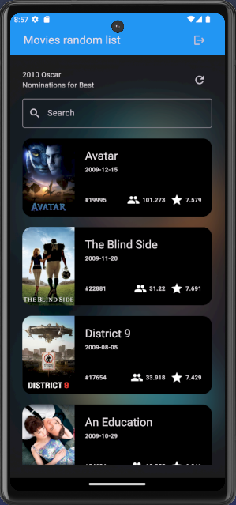
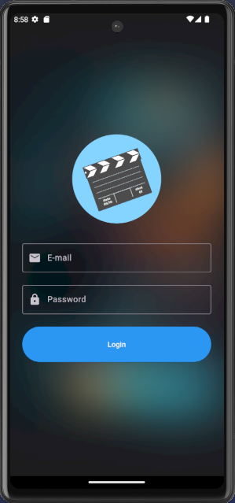
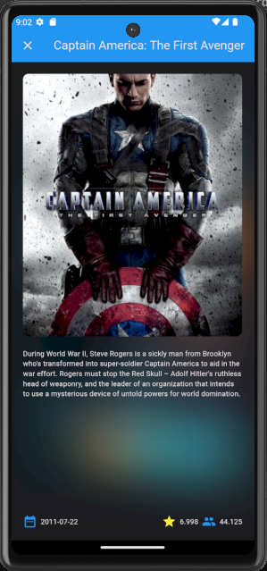

# Movie App

This is a simple movie app that allows users to get random list movies from The Movie Database (TMDb) API.

## Study Case

This project was developed to study and practice the following concepts:

- [x] Flutter Fundamentals
- [x] Design Patterns
- [x] Clean Architecture
- [x] Good Practices
- [x] Cache Management

## Features

- [x] Users can see a list of movies
- [x] Users can see movies details
- [x] Users can ask for a new list of movies

## App Preview

<p float="center">
  
  
  
</p>

## Technologies

- [Flutter](https://flutter.dev/)
- [DIO](https://pub.dev/packages/dio)
- [Shared Preferences](https://pub.dev/packages/shared_preferences)
- [Loties](https://pub.dev/packages/lottie)

## How to run

1. Clone this repository

```bash
git clone git@github.com:laripeanuts/dw-flutter-movieapp.git
```

2. Install dependencies

```bash
flutter pub get
```

3. Run the app

```bash
flutter run
```
